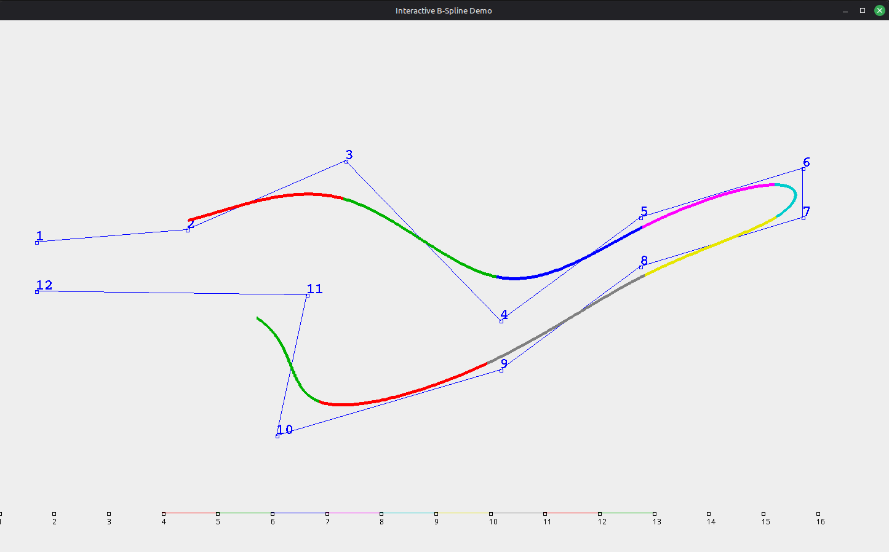

# Draw B-Spline curves
Interactive B-Spline demo. Just mouse drag the points and watch the beautiful curves moving.

Originally a Java applet (circa 2010), converted to a standalone Swing app in 2023.



## How to run
```
$ make run
```
Only requires a Java runtime (`java`). To recompile after editing the source, run `make compile` (requires `javac` / a JDK):
```
$ sudo apt install openjdk-21-jdk-headless
```

## Versions
- OpenJDK 21.0.10
- Ubuntu 24.04
